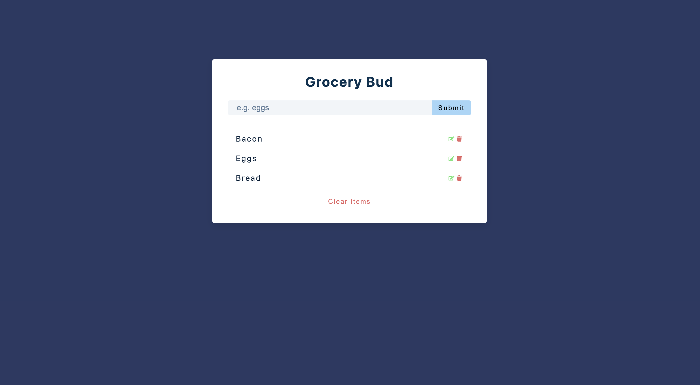

<h1 align="center">Welcome to the React Grocery List Project 👋</h1>

  
  
  

### Screenshot

### Links

- Solution URL: [Github]()
- Live Site URL: [Netlify]()

## Reason for choosing this project:

This was a simple hands-on React project provided by John Smilga as part of his Udemy React Tutorial and Projects Course. This project was designed to help students become familiar with forms, useState, useEffect, editing, and deleting list items.

## Functionality:

Grocery Bud is a grocery list builder application.

- Users can add grocery list items
- Users can edit existing list items
- Users can delete existing list items individually
- Users can delete the entire list collectively
- Users receive an onscreen prompt every time the list is updated

## Technologies:

- React

## Author

- Website - [Michael Payne](https://michaelspayneii.com/)
- Frontend Mentor - [@MSPayneII](https://www.frontendmentor.io/profile/MSPayneII)
- Github - [MSPayneII](https://github.com/MSPayneII)
